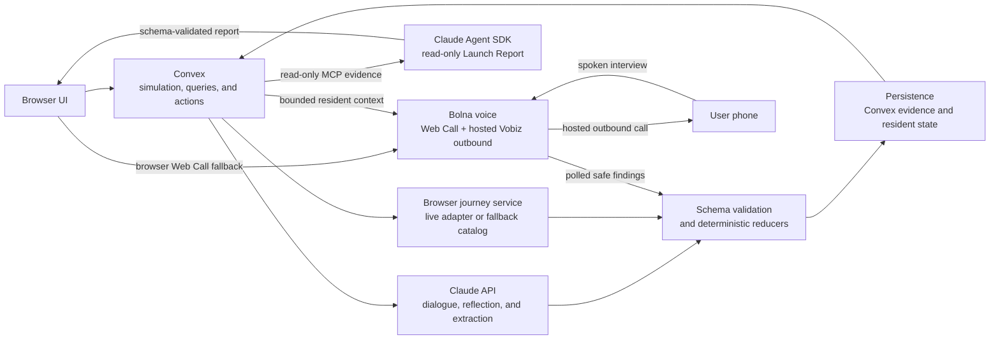
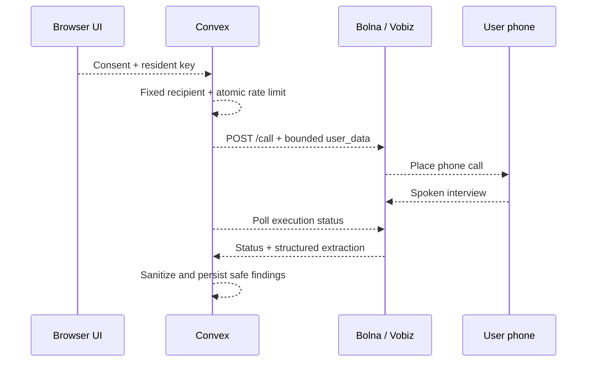

# LaunchTown

> **See your launch spread before you ship.**

LaunchTown is a causal product-launch simulator where autonomous residents discover a product,
experience its website, talk to people they trust, and change one another's awareness, curiosity,
trust, and purchase intent. Instead of returning one opaque score, it exposes the chain of evidence
behind adoption: who learned what, from whom, what they did next, and where the product lost them.

**Hackathon demo:** open `/demo/ledgerly`, select **Start Simulation**, and use the 1x / 4x / 16x
scenario clock to watch the seeded Ledgerly launch move from a first visit to a social cascade and a
founder-ready Launch Report.

## The problem

Teams usually learn why a launch failed only after spending distribution budget. Analytics show what
happened, interviews explain a handful of individual reactions, and synthetic-user tools often
collapse behavior into a score. None of them make the social path from first impression to adoption
easy to inspect.

## The solution

LaunchTown mounts a product inside a small simulated community. Residents have distinct needs, trust
thresholds, relationships, memories, and browsing behavior. Claude turns unstructured dialogue and
website observations into bounded structured intelligence; deterministic application code validates
that intelligence, calculates state deltas, persists evidence, and schedules the next action. The
result is a replayable launch narrative with an auditable causal ledger.

## Key features

- **Inspectable social diffusion** — follow belief transfers and behavioral triggers between named
  residents instead of reading an aggregate prediction.
- **Persistent resident cognition** — dialogue uses relevant memories, and completed conversations
  are summarized and reflected into resident memory.
- **Structured website understanding** — product pages become a validated product model used by the
  simulation.
- **Resident-specific browser journeys** — residents browse with different goals and tolerance for
  friction; journey output must pass schema validation before reducers can apply it.
- **Deterministic state transitions** — relationship strength, susceptibility, and pure reducers own
  every mutation and preserve the audit trail.
- **Voice access to live residents** — Bolna calls a fixed, consented phone destination with bounded
  live resident context; browser Web Call remains available as a fallback.
- **Evidence-grounded Launch Reports** — a read-only, schema-validated Claude Agent SDK workflow
  reconciles influence events, browser runs, resident states, and memories into founder actions.

## Demo flow

1. Open `http://localhost:5173/demo/ledgerly` and select **Start Simulation**.
2. Watch Priya's pre-baked first visit hand the launch to the social graph. The Ledgerly scenario
   includes Priya, Rohan, Meera, Ananya, Dev, Karan, Sneha, and Aarav.
3. Use the speed controls to follow conversations, belief changes, browser decisions, and funnel
   movement. Priya and Rohan have a bidirectional relationship strength of `0.9`; Rohan and Meera
   have `0.7`.
4. Inspect a resident to see their traits, memories, current beliefs, and evidence behind the latest
   state change.
5. Confirm the masked destination and ask a resident to call your phone, or use browser audio as a
   fallback.
6. When the simulation completes, generate the Launch Report to see evidence-linked frictions,
   belief propagation, resident outcomes, and three concrete website fixes.

## Claude intelligence layer

Claude is used only at explicit interpretation boundaries:

1. **Resident dialogue and memory reflection** — residents retrieve semantically relevant memories,
   generate in-character dialogue, summarize completed conversations from their own perspective, and
   reflect on accumulated memories.
2. **Structured product-model extraction** — website content is converted into product facts,
   personas, promises, pricing, calls to action, objections, and likely friction in a validated
   shape.
3. **Structured social-influence extraction** — a transcript becomes bounded awareness, curiosity,
   and trust signals plus beliefs and a behavioral suggestion.
4. **Claude-guided browser journeys** — Claude helps a resident navigate toward an objective, but
   the returned pages, friction, outcome, and evidence are schema-validated and interpreted before
   any state update.
5. **Read-only Launch Report agent** — the existing Claude Agent SDK path can call only four mounted
   MCP evidence tools. All four must be used, the report must match a JSON schema, and the agent has
   no simulation write tool.

### Safety boundary

**Claude proposes structured intelligence; Convex and deterministic reducers own mutations.**

For social influence, the applied delta is calculated in code:

```text
delta = signal x relationshipStrength x socialSusceptibility
```

Signals are clamped, beliefs are normalized, browser results are validated, and every accepted
change is written through controlled Convex mutations. Claude cannot directly edit resident state,
advance the simulation, or persist arbitrary report evidence.

## Current architecture



Browser live-view URLs and Bolna session credentials are credential-like and are never logged.

### Hosted outbound resident interviews

The Bolna agent uses Vobiz-backed centralized outbound calling. The browser never submits a phone
number: it confirms a server-provided mask, and Convex reads the fixed E.164 destination from a
server-only environment variable.

```text
persona click -> E.164 phone call -> spoken interview -> structured result persistence
```

Convex atomically permits only one active call, enforces a ten-minute cooldown and a six-call
rolling daily cap, sends the same bounded seven-variable resident context to `POST /call`, and polls
`GET /executions/{id}` to completion. It persists only lifecycle timestamps, duration, provider, and
privacy-scrubbed structured findings. API credentials, full numbers, recording URLs, transcripts,
and raw provider responses are never persisted or returned to the browser.



## Local setup

Prerequisites: Node.js, npm, and a Convex project.

```sh
npm install
npx convex dev --once --run init
npm run dev
```

The app runs at `http://localhost:5173`; the seeded demo is at
`http://localhost:5173/demo/ledgerly`.

Set server-side secrets in Convex, never in committed files:

```sh
npx convex env set ANTHROPIC_API_KEY '<key>'
npx convex env set BROWSER_JOURNEY_MODE fallback
```

The inherited memory-embedding path still has provider-specific environment requirements in code.
Configure the variables required by the embedding adapter used in your deployment; this README keeps
embedding configuration provider-neutral and intentionally omits vendor-specific examples.

For optional live browser journeys:

```sh
npx convex env set BROWSERBASE_API_KEY '<key>'
npx convex env set BROWSERBASE_PROJECT_ID '<project-id>'
npx convex env set BROWSER_JOURNEY_MODE browserbase
```

`BROWSER_JOURNEY_MODE` defaults to `fallback`, which uses precomputed journeys and exercises the
same persistence and result-interpretation boundary without consuming browser minutes. In
`browserbase` mode, only the demo-critical resident Rohan runs live; other residents retain
deterministic fallback data.

For phone interviews and the browser voice fallback:

```sh
npx convex env set BOLNA_API_KEY '<key>'
npx convex env set BOLNA_AGENT_ID '<agent-id>'
npx convex env set BOLNA_ALLOWED_ORIGINS 'https://your-launch-town.vercel.app'
npx convex env set BOLNA_OUTBOUND_RECIPIENT_PHONE '<fixed-e164-destination>'
```

The browser receives only the masked destination and sanitized lifecycle state. The API key, full
destination, execution details, and resident context stay server-side. Per-call context is bounded
and supplies `name`, `product`, `personality`, `beliefs`, `experiences`, `hearsay`, and `stage` from
current Convex state. Add an explicit localhost origin to `BOLNA_ALLOWED_ORIGINS` when testing
locally; production does not implicitly trust localhost.

## Verification

For this documentation-only change:

```sh
git diff --check
npx prettier --check README.md
```

For application changes, run the complete project checks:

```sh
npm test
npm run build
npm --prefix launch-town-browser test
npm --prefix launch-town-browser run typecheck
npm --prefix launch-town-browser run build
```

## Architecture guide

- [`convex/agent/conversation.ts`](./convex/agent/conversation.ts) and
  [`convex/agent/memory.ts`](./convex/agent/memory.ts) — resident dialogue, retrieval, conversation
  summaries, and memory reflection.
- [`convex/launchTown/productAnalyzer.ts`](./convex/launchTown/productAnalyzer.ts) and
  [`launch-town-browser/src/productModelAnalyzer.ts`](./launch-town-browser/src/productModelAnalyzer.ts)
  — structured product-model extraction.
- [`convex/launchTown/influenceActions.ts`](./convex/launchTown/influenceActions.ts) and
  [`convex/launchTown/influence.ts`](./convex/launchTown/influence.ts) — structured influence
  extraction and pure application logic.
- [`convex/launchTown/browserRunner.ts`](./convex/launchTown/browserRunner.ts) and
  [`launch-town-browser/src/resultInterpreter.ts`](./launch-town-browser/src/resultInterpreter.ts) —
  browser orchestration, validation, interpretation, and fallback handling.
- [`api/_lib/claudeReportAgent.ts`](./api/_lib/claudeReportAgent.ts) — existing Agent SDK report
  loop, read-only MCP allowlist, and JSON-schema output.
- [`convex/launchTown/voiceContext.ts`](./convex/launchTown/voiceContext.ts) — bounded live-state
  serialization for browser Web Call sessions.

## Future architecture

The Launch Report already uses the Claude Agent SDK. The next step is to expand that same pattern
for resident website research: grant narrowly scoped MCP tools through explicit allowlists, require
JSON-schema outputs, package repeatable research behavior as Skills, delegate bounded exploration to
specialized subagents, and resume sessions when a journey spans multiple interactions.

The Agent SDK is an **SDK/runtime that runs the agent loop in the application's own process**; it is
not hosted managed-agent infrastructure. LaunchTown must continue to own execution, sandboxing,
credentials, budgets, deterministic validation, and persistence.

Official Agent SDK references:

- [Overview](https://code.claude.com/docs/en/agent-sdk/overview)
- [Custom tools and MCP](https://code.claude.com/docs/en/agent-sdk/custom-tools)
- [Structured outputs](https://code.claude.com/docs/en/agent-sdk/structured-outputs)
- [Subagents and resumable sessions](https://code.claude.com/docs/en/agent-sdk/subagents)

## Roadmap

- Extend resident research with constrained Agent SDK sessions, Skills, and task-specific subagents.
- Add more launch scenarios and product categories while preserving replayable causal evidence.
